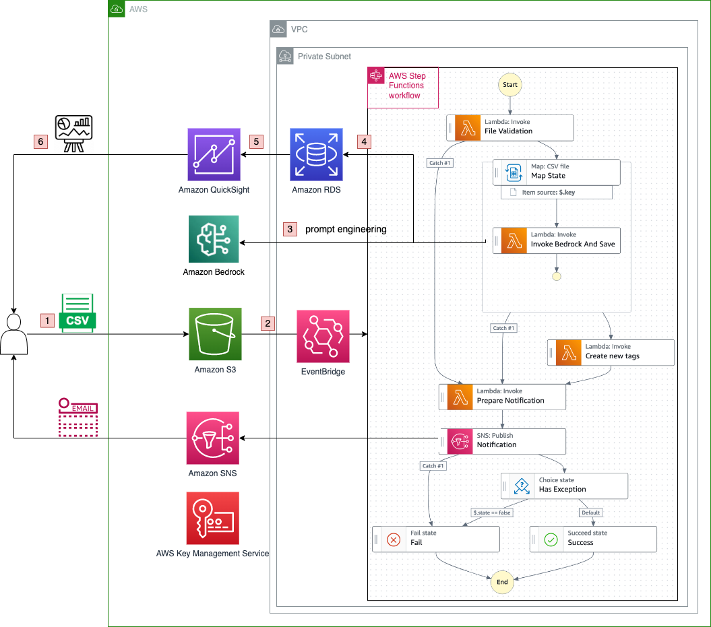

# Automated LLM Insight Discovery Framework

LLMs have revolutionized the way we interact with and process natural language. With their ability to understand, generate, and analyze text, LLMs offer a wide range of possibilities across various domains and industries. This project explores how LLMs can be integrated into enterprise applications to harness their generative capabilities and drive better decision-making.

## Key use-case scenario and components

- **Customer Feedback Categorization and Sentiment Classification**: Analyze customer comments and reviews to extract specific aspects and determine sentiment, enabling data-driven improvements in customer experience.
- **Email Categorization for Customer Service**: Automatically categorize customer emails into predefined categories for efficient routing to appropriate departments or teams, improving response times and customer satisfaction.
- **Web Data Analysis for Product Information Extraction**: Extract key product details from e-commerce websites, such as titles, pricing, and descriptions, to facilitate accurate data management and analysis.

## Architecture and data flow

Following is the architecture


The data flow is as below:
1. User upload CSV file of user feedback to S3 bucket, where the default CSV file format is `product_name,store,id,stars,title,feedback,date`. You can find more from the [sample CSV file](docs/sample_data.csv). 
1. The S3 data event will trigger a step function. You can find more in the [Workflow Orchestration session](#workflow-orchestration) below.
1. The Lambda function customer-service-dev-InvokeBedrockAndSave in step function will extract the feedback from CSV, invoke the Amazon Bedrock LLM to categorize them. Please find more in the [LLM and Prompt Engineering session below](#llm-and-prompt-engineering).
1. And then save the result to RDS database.
1. You can then configure the Amazon Quicksight to visualize the results in RDS database. Please find more in the [Visualization session](#visualization) below.
1. You can see the chart dashboard of Amazon Quicksight.


#### Workflow Orchestration
This project utilizes AWS Step Functions to orchestrate the end-to-end workflow, including data preprocessing, LLM inference, post-processing, and user notification. For more details, refer to [the Workflow Orchestration documentation](docs/AWS_Cloud9_CDK_Deployment_Manual.md).


#### LLM and Prompt Engineering
Amazon Bedrock, a fully managed service that offers a choice of high-performing foundation models, is used to invoke LLMs in this project. Prompt engineering techniques are employed to craft effective prompts for specific tasks. Following is the prompt used in the Lambda function `customer-service-dev-InvokeBedrockAndSave`. Please feel free to modify according to your need.

```
You are tasked with selecting an appropriate tag from the given lists based on user feedback enclosed within the `<feedback>` XML tag.
        
        Here is the list of potential tags:
        <tags>
        $tags
        </tags>
        
        <title>
        $title
        </title>
        
        <feedback>
        $feedback
        </feedback>

        Please choose only one from tag list and response to the user’s questions within <tag></tag> tags. If none of the tags above are suitable for the feedback or information is not enough, return "unknown". No explanation is required. No need to echo tag list and feedback. No need to echo
        feedback.

```

#### Visualization
Amazon QuickSight, a cloud-powered business analytics service, is used to visualize the insights extracted from the processed data. Refer to the Visualization documentation for more details [the Visualization documentation for more details](docs/AWS_Cloud9_Quicksight_Setup_Manual.md).


## Getting Started


#### Installation for workflow automation pipeline
Please refer to [installation manual for workflow automation](docs/AWS_Cloud9_CDK_Deployment_Manual.md)


#### Visualization in Amazon Quicksight

Please refer to [installation manual for data visualization](docs/AWS_Cloud9_Quicksight_Setup_Manual.md)


## Disclaimer: Use of Prompt Engineering Templates


Any prompt engineering template is provided to you as AWS Content under the AWS Customer Agreement, or the relevant written agreement between you and AWS (whichever applies). You should not use this prompt engineering template in your production accounts, or on production, or other critical data. You are responsible for testing, securing, and optimizing the prompt engineering as appropriate for production grade use based on your specific quality control practices and standards. AWS may reuse this prompt engineering template in future engagements, but we will not share your confidential data nor your intellectual property with other customers.

## Security Considerations


The sample code; software libraries; command line tools; proofs of concept; templates; or other related technology (including any of the foregoing that are provided by our personnel) is provided to you as AWS Content under the AWS Customer Agreement, or the relevant written agreement between you and AWS (whichever applies). You should not use this AWS Content in your production accounts, or on production or other critical data. You are responsible for testing, securing, and optimizing the AWS Content, such as sample code, as appropriate for production grade use based on your specific quality control practices and standards. Deploying AWS Content may incur AWS charges for creating or using AWS chargeable resources, such as running Amazon EC2 instances or using Amazon S3 storage.


There are a number of security considerations that should be taken into account prior to deploying and utilising this sample. The security section of the provided documentation outlines each of these.

## License

This library is licensed under the MIT-0 License. See the LICENSE file.

