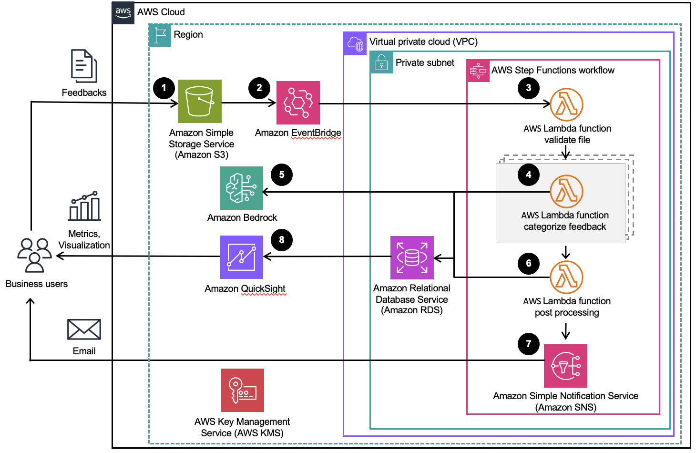

# Guidance for Automated LLM Insight Discovery Framework on AWS


## Table of Contents

1. [Overview](#overview)
    - [Cost](#cost)
    - [Architecture and data flow](#architecture-and-data-flow)
2. [Prerequisites](#prerequisites)
    - [Operating System](#operating-system)
    - [Third-party tools](#third-party-tools)
    - [AWS account requirements](#aws-account-requirements)
    - [AWS cdk bootstrap](#aws-cdk-bootstrap)
3. [Deployment Steps](#deployment-steps)
4. [Deployment Validation](#deployment-validation)
5. [Running the Guidance](#running-the-guidance)
6. [Next Steps](#next-steps)
7. [Cleanup](#cleanup)
8. [FAQ, known issues, additional considerations, and limitations](#faq-known-issues-additional-considerations-and-limitations)
9. [Notices](#notices)
10. [License](#license)


## Overview

This project explores how Large Language Models (LLMs) can be integrated into enterprise applications to harness their generative capabilities and drive better decision-making. The key use-case scenarios and components include:

- **Customer Feedback Categorization and Sentiment Classification**: Analyze customer comments and reviews to extract specific aspects and determine sentiment, enabling data-driven improvements in customer experience.
- **Email Categorization for Customer Service**: Automatically categorize customer emails into predefined categories for efficient routing to appropriate departments or teams, improving response times and customer satisfaction.
- **Web Data Analysis for Product Information Extraction**: Extract key product details from e-commerce websites, such as titles, pricing, and descriptions, to facilitate accurate data management and analysis.


### Cost

_You are responsible for the cost of the AWS services used while running this Guidance. As of September 2024, the cost for running this Guidance with the default settings in the US East (N. Virginia) is approximately $775.10 per month for processing 1,000,000 feedbacks every month._

_We recommend creating a [Budget](https://docs.aws.amazon.com/cost-management/latest/userguide/budgets-managing-costs.html) through [AWS Cost Explorer](https://aws.amazon.com/aws-cost-management/aws-cost-explorer/) to help manage costs. Prices are subject to change. For full details, refer to the pricing webpage for each AWS service used in this Guidance._

### Sample Cost Table

| AWS Service | Dimensions | Cost [USD] |
| ----------- | ------------ | ------------ |
| Amazon S3 Standard | 1 million feedbacks for 10 GB storage per month | $0.23/month |
| Amazon EventBridge | 1 feedback file upload every day for 30 events per month | $0.000006/month |
| AWS Step Functions | 30 workflow requests per month | $0.00 |
| AWS Lambda | 1 million requests per month | $0.41/month |
| Amazon SNS Standard topics | 30 email notifications per month | $0.09/month |
| Amazon RDS for MySQL | 1 Multi-AZ db.m5.large instance with 100 GB storage | $272.66/month |
| Amazon Redcock | 1 billion input token, 100 million output token, use Claude 3 Sonnet | $450.00/month |
| Amazon QuickSight | 1 author and 10 readers, 10G in-memory data store | $51.80/month |


### Architecture and data flow

Following is the architecture


The data flow is as below:
1. Business users upload csv file of user feedbacks to Amazon Simple Storage Service (Amazon S3) bucket. The default CSV file format is `product_name,store,id,stars,title,feedback,date`. You can find more from the [sample CSV file](docs/sample_data.csv). 
1. The Amazon S3 data event of the uploaded files will trigger the step function through Amazon EventBridge. You can find more in the [Workflow Orchestration session](#workflow-orchestration) below.
1. The AWS Lambda file validation function in the AWS Step Function will extract the feedback from csv, and validate the file. 
1. AWS Step Function uses Map state to call Lambda categorize function for each feedback in the csv, in parallel. The Lambda categorize function will invoke the Amazon Bedrock LLM to categorize the feedback and save the result to Amazon Relational Database Service (Amazon RDS) database. Please find more in the [LLM and Prompt Engineering session below](#llm-and-prompt-engineering). The RDS database has table `customer_feedback` with columns `id,product_name,store,ref_id,stars,title,feedback,label_llm,create_date,last_updated_time,label_post_processing,label_correction,execution_id`. 
1. If there is no right category for certain amount of feedbacks, the Lambda create new category function will create new category.
1. At the end, AWS Step Function will publish the running result to Amazon Simple Notification Service (Amazon SNS) topic.  
1. Configure the Amazon Quicksight to visualize the results in Amazon RDS database. Please find more in the [Visualization session](#visualization) below.


#### Workflow Orchestration
This project utilizes AWS Step Functions to orchestrate the end-to-end workflow, including data preprocessing, LLM inference, post-processing, and user notification. For more details, refer to [the Workflow Orchestration documentation](docs/AWS_Cloud9_CDK_Deployment_Manual.md).


#### LLM and Prompt Engineering
Amazon Bedrock, a fully managed service that offers a choice of high-performing foundation models, is used to invoke LLMs in this project. Prompt engineering techniques are employed to craft effective prompts for specific tasks. Following is the prompt used in the Lambda function `customer-service-dev-InvokeBedrockAndSave`. Please feel free to modify [prompt.py](auto_tag/lambdas/invoke_bedrock_and_save/utils/prompt.py) according to your need.

```
You are tasked with selecting an appropriate tag from the given lists based on user feedback enclosed within the `<feedback>` XML tag.
        
        Here is the list of potential tags:
        <tags>
        $tags
        </tags>
        
        <title>
        $title
        </title>
        
        <feedback>
        $feedback
        </feedback>

        Please choose only one from tag list and response to the user’s questions within <tag></tag> tags. If none of the tags above are suitable for the feedback or information is not enough, return "unknown". No explanation is required. No need to echo tag list and feedback. No need to echo
        feedback.

```

This framework stores the pre-defined tags in RDS table `customer_feedback_category`, and initializes it in Lambda function inin_db_script. After downloading the framework, you can update your own pre-defined tags in [default_categories.json](auto_tag/lambdas/init_db_script/default_categories.json) file. Please update this file before you run `cdk deploy` deployment command. 

#### Visualization
Amazon QuickSight, a cloud-powered business analytics service, is used to visualize the insights extracted from the processed data. Refer to the Visualization documentation for more details [the Visualization documentation for more details](docs/AWS_Cloud9_Quicksight_Setup_Manual.md).


## Prerequisites

Before beginning the deployment, ensure you meet the following prerequisites.

### Operating System

These deployment instructions are optimized to best work on **AWS Cloud9** with image **Ubuntu Server 22.04 LTS**. Deployment in another OS may require additional steps.

### Third-party tools

- Python >=3.10,<4
- AWS CDK
- AWS CLI v2


### AWS account requirements

- IAM Permissions: The IAM user or role used for the deployment should have sufficient permissions to access the following AWS services:
    - IAM
    - CloudFormation
    - Amazon S3
    - SSM Parameter Store
    - Amazon RDS for MySQL
    - AWS Lambda
    - Amazon CloudWatch
    - Secrets Manager
    - Amazon VPC
    - Cloud9
    - Amazon SNS
    - AWS Step Functions
- VPC Availability: Ensure that at least one additional VPC slot is available in your account, as the default limit is typically 5 VPCs per region.
- Amazon Bedrock Model Setting: Verify your Bedrock model settings to ensure compatibility with the deployment.

- Setting Up Amazon Quicksight: For visualizing data and creating reports with AWS Quicksight, follow these steps:
  - Sign up for AWS Quicksight.
  - Navigate to Manage QuickSight in the Quicksight console, then select Security and Permissions.
  - Verify that the two default roles (`aws-quicksight-service-role-v0` and `aws-quicksight-secretsmanager-role-v0`) required by the Quicksight system are present in the IAM console.

### AWS cdk bootstrap

This Guidance uses aws-cdk. If you are using aws-cdk for the first time, please perform the below bootstrapping:

``
cdk bootstrap aws://ACCOUNT-NUMBER/REGION
``
Replace `ACCOUNT-NUMBER` and `REGION` with your AWS account number and desired AWS region.

## Deployment Steps

The deployment process outlined below is specifically designed for the `us-east-1` region.

#### Setting Up Cloud9 as Deployment Environment
Cloud9 provides a pre-configured environment that simplifies the deployment process. Here's how to set it up:

- Log into the AWS Management Console and access the AWS Cloud9 service.
- Click on "Create environment" and enter "cdk-deployment-env" as the name for your new environment.
Select **"Ubuntu Server 22.04 LTS"** as the platform and choose an instance type (e.g., m5.xlarge for optimal performance).
- Configure additional settings such as VPC and subnet if necessary, ideally selecting us-east-1d for the subnet.

Once configured, launch the environment by clicking on "Create environment".


### Deploy with AWS CDK

Follow these steps to deploy the prototype using the AWS Cloud Development Kit (CDK):

- Access the Cloud9 environment and open the terminal.
- Resize the EBS volume for your environment:
for example : Resize Cloud9 Volume to 50G
```commandline
source <(curl -s https://raw.githubusercontent.com/aws-samples/aws-swb-cloud9-init/mainline/cloud9-resize.sh)
```

- Set up projen
```commandline
node -v
npm install -g projen
```
- Prepare your environment
```commandline
git clone git@github.com:aws-samples/automated-llm-insight-discovery-framework.git
cd automated-llm-insight-discovery-framework

# Setup and activate Python environment
python -m venv .env
source .env/bin/activate
```

- Package lambda layers  
We request that Python version 3.12 be used due to its compatibility with the latest Lambda container.
```commandline
cd auto_tag/lambda_layers/third-party
pip3 install -r requirements.txt --platform manylinux2014_x86_64 --only-binary=:all: --implementation cp --target=python/ --upgrade --python-version 3.12
zip -r layer.zip python/
```

- CDK deploy
```commandline
cd ~/environment/automated-llm-insight-discovery-framework
pip install projen

# Initialize and deploy the project (the deployment will takes around 15~20 minutes)
npx projen build
cdk bootstrap
cdk deploy
```


## Deployment Validation


- Open the AWS CloudFormation console and verify the status of the template with the name starting with `customer-service-dev`.
- If the deployment is successful, you should see an active RDS database instance with the name starting with `customer-service-dev` in the RDS console.
- Run the following CLI command to validate the deployment: `aws cloudformation describe-stacks --stack-name <stack-name>`

## Running the Guidance


### RDS Initialization  
Go to lambda console and find the function named  ***-InitDbScript, and test the function to run it.

You will get a response message if every works

```json
{
"statusCode": 200,
"body": "\"Table Set up is Done!\""
}
```

This Lambda function drops all existing tables and create new tables. We highly recommend that you modify the lambda_handler function immediately to prevent accidentally removing your data in RDS. 

The table customer_feedback will be created by the statement below:
```
CREATE TABLE customer_feedback (
        id SERIAL PRIMARY KEY,
        product_name VARCHAR(255),
        store VARCHAR(20),
        ref_id VARCHAR(100),
        stars VARCHAR(5),
        title VARCHAR(255),
        feedback TEXT NOT NULL,
        label_llm VARCHAR(255),
        create_date TIMESTAMP WITH TIME ZONE DEFAULT CURRENT_TIMESTAMP,
        last_updated_time TIMESTAMP WITH TIME ZONE DEFAULT CURRENT_TIMESTAMP,
        label_post_processing VARCHAR(255),
        label_correction VARCHAR(255),
        execution_id TEXT
    );
```

This framework also stores the pre-defined tags in RDS table `customer_feedback_category`, and initializes it in Lambda function inin_db_script. After downloading the framework, you can update your own pre-defined tags in [default_categories.json](../auto_tag/lambdas/init_db_script/default_categories.json) file. Please update this file before you run the Lambda function. After you run the Lambda function, you can modify the RDS table yourself.


### Upload the sample_data.csv to test the end to end workflow

- Get the S3 bucket name

Go to CloudFormation stack customer-service-dev, find the value of key ResourceDataBucketName in its output.


- Upload [sample_data.csv](sample_data.csv) to the bucket to trigger the end to end workflow

- Continue in the [Data Visualization](./AWS_Cloud9_Quicksight_Setup_Manual.md) to visualize the result.


## Next Steps

### Visualization in Amazon Quicksight

Please refer to [installation manual for data visualization](docs/AWS_Cloud9_Quicksight_Setup_Manual.md)

### Framework customization

- Customize the predefined tags in the `default_categories.json` file to align with your specific use case.
- Modify the prompt in the `prompt.py` file to fine-tune the LLM's performance for your task.
- Explore different visualization options in Amazon QuickSight to gain deeper insights into your data.

Please refer to [Framework customization](docs/customization.md) for more information.

## Cleanup

If you want to delete all stacks created by this CDK app, you can empty the S3 bucket, and then delete the stack `customer-service-dev` in CloudFormation or run the command below in your Cloud9 project path:
```
cdk destroy customer-service-dev
```

## FAQ, known issues, additional considerations, and limitations


1. Deployment in other region

AWS Lambda layers ARN can vary by region, we are utilizing a layer that includes the pandas library.

For example for us-west-2, you need to use 
```python
arn:aws:lambda:us-west-2:336392948345:layer:AWSSDKPandas-Python312:6
```

please open the file `.projenrc.py` and modify the parameter `sdk_pandas_layer` 

Please check your region here. https://aws-sdk-pandas.readthedocs.io/en/stable/layers.html

## Notices


Customers are responsible for making their own independent assessment of the information in this Guidance. This Guidance: (a) is for informational purposes only, (b) represents AWS current product offerings and practices, which are subject to change without notice, and (c) does not create any commitments or assurances from AWS and its affiliates, suppliers or licensors. AWS products or services are provided "as is" without warranties, representations, or conditions of any kind, whether express or implied. AWS responsibilities and liabilities to its customers are controlled by AWS agreements, and this Guidance is not part of, nor does it modify, any agreement between AWS and its customers.

### Disclaimer: Use of Prompt Engineering Templates

Any prompt engineering template is provided to you as AWS Content under the AWS Customer Agreement, or the relevant written agreement between you and AWS (whichever applies). You should not use this prompt engineering template in your production accounts, or on production, or other critical data. You are responsible for testing, securing, and optimizing the prompt engineering as appropriate for production grade use based on your specific quality control practices and standards. AWS may reuse this prompt engineering template in future engagements, but we will not share your confidential data nor your intellectual property with other customers.

### Security Considerations

The sample code; software libraries; command line tools; proofs of concept; templates; or other related technology (including any of the foregoing that are provided by our personnel) is provided to you as AWS Content under the AWS Customer Agreement, or the relevant written agreement between you and AWS (whichever applies). You should not use this AWS Content in your production accounts, or on production or other critical data. You are responsible for testing, securing, and optimizing the AWS Content, such as sample code, as appropriate for production grade use based on your specific quality control practices and standards. Deploying AWS Content may incur AWS charges for creating or using AWS chargeable resources, such as running Amazon EC2 instances or using Amazon S3 storage.


## License

This library is licensed under the MIT-0 License. See the LICENSE file.

