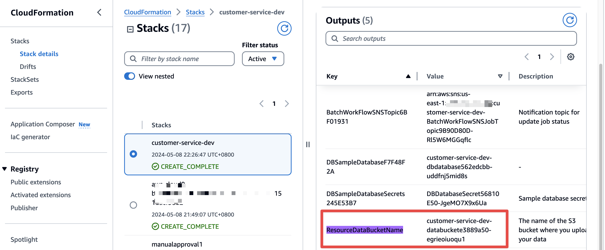

## GitHub Repository: Deployment Guide
Welcome to the GitHub repository for our prototype project. This guide provides comprehensive instructions for deploying the prototype, setting up a deployment environment, and integrating AWS services to facilitate the deployment and operational processes.


### Getting Started
Please follow these steps to prepare your system for deploying the prototype.

The deployment process outlined below is specifically designed for the `us-east-1` region.

#### Prerequisites

Before beginning the deployment, ensure you meet the following prerequisites:

- IAM Permissions: The IAM user or role used for the deployment should have sufficient permissions to access the following AWS services:
    - IAM
    - CloudFormation
    - S3
    - SSM Parameter Store
    - RDS
    - Lambda
    - CloudWatch
    - Secrets Manager
    - VPC
    - Cloud9
- VPC Availability: Ensure that at least one additional VPC slot is available in your account, as the default limit is typically 5 VPCs per region.
- Bedrock Model Setting: Verify your Bedrock model settings to ensure compatibility with the deployment.

- Setting Up AWS Quicksight: For visualizing data and creating reports with AWS Quicksight, follow these steps:
  - Sign up for AWS Quicksight.
  - Navigate to Manage QuickSight in the Quicksight console, then select Security and Permissions.
  - Verify that the two default roles (`aws-quicksight-service-role-v0` and `aws-quicksight-secretsmanager-role-v0`) required by the Quicksight system are present in the IAM console.


#### Setting Up Cloud9 as Deployment Environment
Cloud9 provides a pre-configured environment that simplifies the deployment process. Here's how to set it up:

- Log into the AWS Management Console and access the AWS Cloud9 service.
- Click on "Create environment" and enter "cdk-deployment-env" as the name for your new environment.
Select **"Ubuntu Server 22.04 LTS"** as the platform and choose an instance type (e.g., m5.xlarge for optimal performance).
- Configure additional settings such as VPC and subnet if necessary, ideally selecting us-east-1d for the subnet.

Once configured, launch the environment by clicking on "Create environment".


### Deploy with AWS CDK

Follow these steps to deploy the prototype using the AWS Cloud Development Kit (CDK):

- Access the Cloud9 environment and open the terminal.
- Resize the EBS volume for your environment:
for example : Resize Cloud9 Volume to 50G
```commandline
source <(curl -s https://raw.githubusercontent.com/aws-samples/aws-swb-cloud9-init/mainline/cloud9-resize.sh)
```

- Set up projen
```commandline
node -v
npm install -g projen
```
- Prepare your environment
```commandline
git clone git@github.com:aws-samples/automated-llm-insight-discovery-framework.git
cd automated-llm-insight-discovery-framework

# Setup and activate Python environment
python -m venv .env
source .env/bin/activate
```

- Package lambda layers  
We request that Python version 3.12 be used due to its compatibility with the latest Lambda container.
```commandline
cd auto_tag/lambda_layers/third-party
pip3 install -r requirements.txt --platform manylinux2014_x86_64 --only-binary=:all: --implementation cp --target=python/ --upgrade --python-version 3.12
zip -r layer.zip python/
```

- CDK deploy
```commandline
cd ~/environment/automated-llm-insight-discovery-framework
pip install projen

# Initialize and deploy the project (the deployment will takes around 15~20 minutes)
npx projen build
cdk bootstrap
cdk deploy
```

- RDS Initialization  
Go to lambda console and find the function named  ***-InitDbScript, and test the function to run it.

You will get a response message if every works

```json
{
"statusCode": 200,
"body": "\"Table Set up is Done!\""
}
```

This Lambda function drops all existing tables and create new tables. We highly recommend that you modify the lambda_handler function immediately to prevent accidentally removing your data in RDS. 

The table customer_feedback will be created by the statement below:
```
CREATE TABLE customer_feedback (
        id SERIAL PRIMARY KEY,
        product_name VARCHAR(255),
        store VARCHAR(20),
        ref_id VARCHAR(100),
        stars VARCHAR(5),
        title VARCHAR(255),
        feedback TEXT NOT NULL,
        label_llm VARCHAR(255),
        create_date TIMESTAMP WITH TIME ZONE DEFAULT CURRENT_TIMESTAMP,
        last_updated_time TIMESTAMP WITH TIME ZONE DEFAULT CURRENT_TIMESTAMP,
        label_post_processing VARCHAR(255),
        label_correction VARCHAR(255),
        execution_id TEXT
    );
```

This framework also stores the pre-defined tags in RDS table `customer_feedback_category`, and initializes it in Lambda function inin_db_script. After downloading the framework, you can update your own pre-defined tags in [default_categories.json](../auto_tag/lambdas/init_db_script/default_categories.json) file. Please update this file before you run the Lambda function. 

### Upload the sample_data.csv to test the end to end workflow

- Get the S3 bucket name

Go to CloudFormation stack customer-service-dev, find the value of key ResourceDataBucketName in its output.



- Upload [sample_data.csv](sample_data.csv) to the bucket to trigger the end to end workflow

- Continue in the [Data Visualization](./AWS_Cloud9_Quicksight_Setup_Manual.md) to visualize the result.

### Clean up

If you want to delete all stacks created by this CDK app, you can empty the S3 bucket, and then delete the stack `customer-service-dev` in CloudFormation or run the command below in your Cloud9 project path:
```
cdk destroy customer-service-dev
```

### TroubleShooting

1. Deployment in other region

AWS Lambda layers ARN can vary by region, we are utilizing a layer that includes the pandas library.

For example for us-west-2, you need to use 
```python
arn:aws:lambda:us-west-2:336392948345:layer:AWSSDKPandas-Python312:6
```

please open the file `.projenrc.py` and modify the parameter `sdk_pandas_layer` 

Please check your region here. https://aws-sdk-pandas.readthedocs.io/en/stable/layers.html


