## GitHub Repository: Prototype Deployment Guide
This is to 

#### Prerequisites
Please refer to [CDK installation guide](AWS_Cloud9_CDK_Deployment_Manual.md) for the installation guidance.

#### Quicksight Configuration

- Quicksight Set secret manager
Choose your user name on the application bar and then choose Manage QuickSight. Go to security and permissions tab, select the secret we create for the database connection.

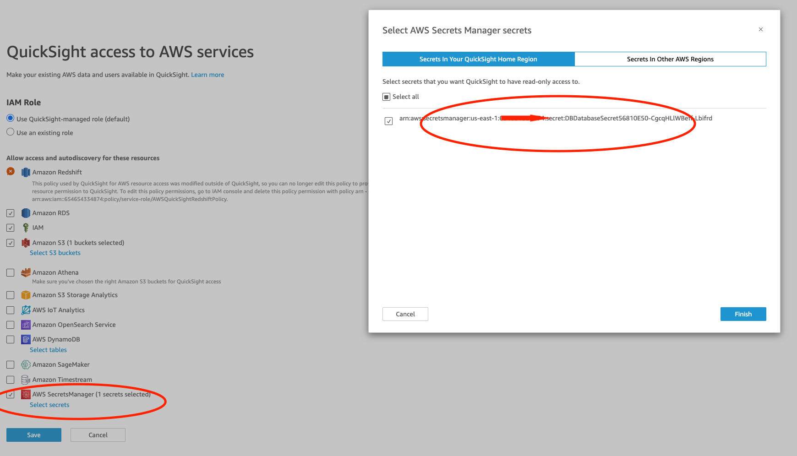

- Change the options to enable VpcConnection and DataSource


open file `.projenrc.py` and modify the option for `create_quicksight_vpc_rds_datasource`. In Cloud8 settings, you need to remove the “.*” in the Hidden File Pattern to view the file `.projenrc.py` in Cloud9 file tree.

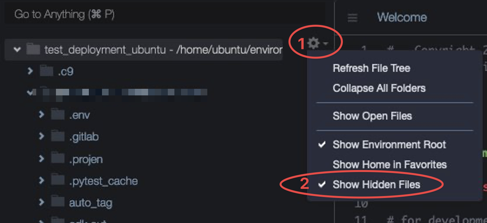

```python
"create_quicksight_vpc_rds_datasource": True,
```

Make the changes (the deployment will takes around 3~4 minutes)
```commandline
npx projen build
cdk deploy
```

#### Create Data Source and Tables in Quicksight

- Data Preparation - Creating a Dataset
Find the RDS Database Secrets in CloudFormation:
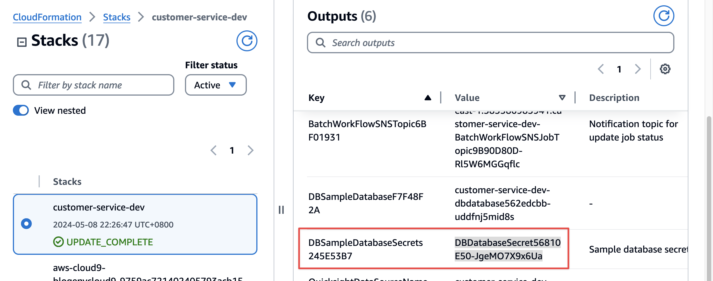
Find the RDS Database Secrets values in AWS Secrets Manager:
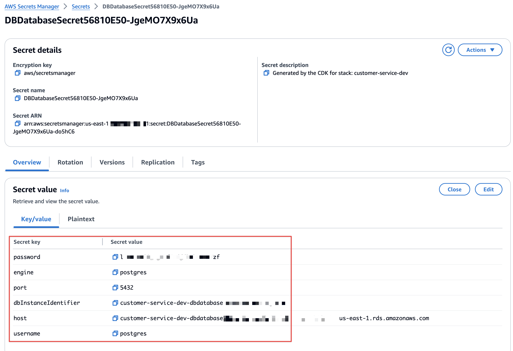

From the left navigation bar, select Datasets, click New dataset:
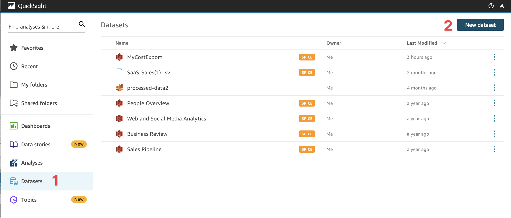

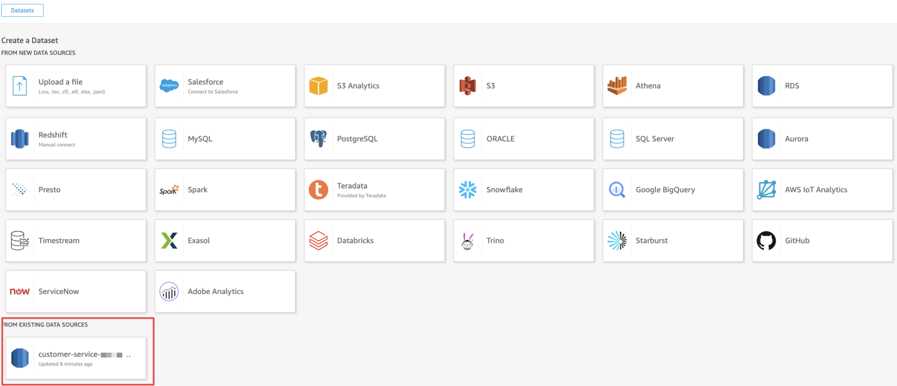

Use custom SQL and Edit/Preview data:
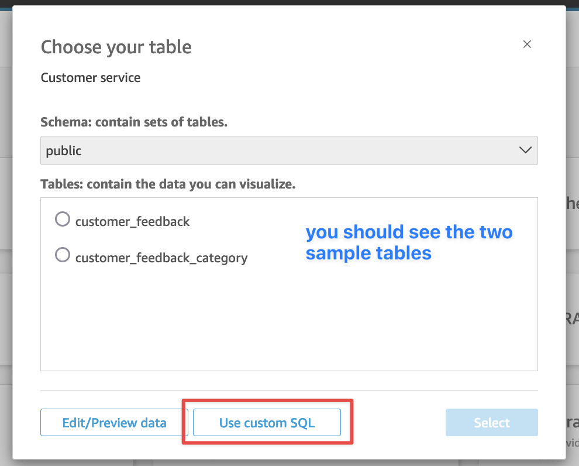

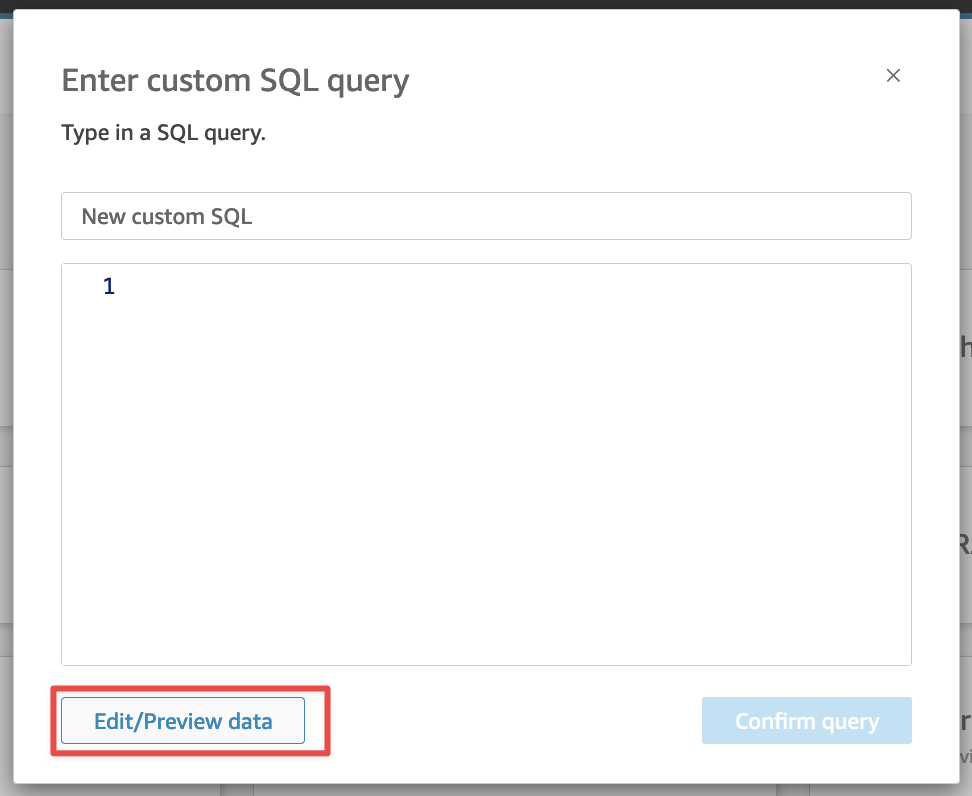

Give Custom SQL name (e.g. customer_feedback_filtered) and use Custom SQL below:

```
SELECT x.*
FROM (
  SELECT *, ROW_NUMBER() OVER (PARTITION BY ref_id ORDER BY last_updated_time DESC) AS rn
  FROM customer_feedback
) x
WHERE x.rn = 1
```

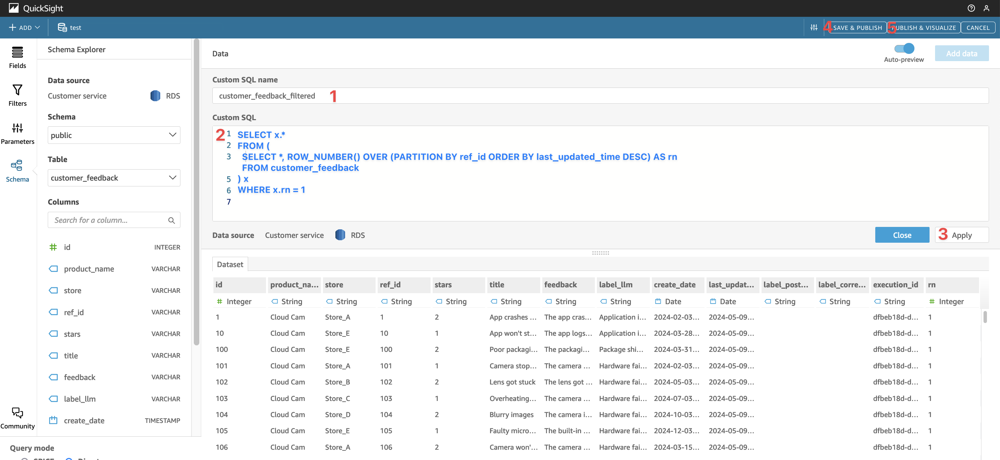

- Data Visualization
You can create new analysis:
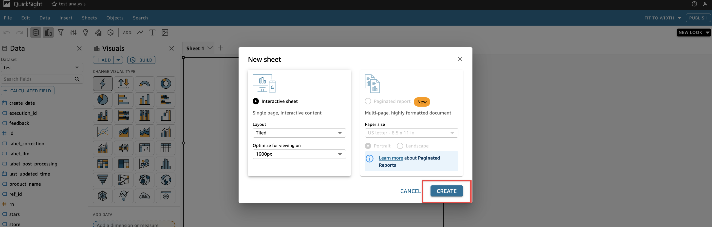

Create a new calculated field to handle the integration logic of label_llm and label_post_processing.
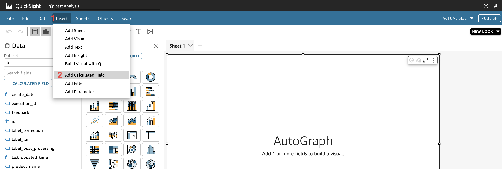

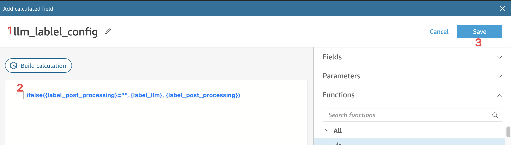

Then you should see a new field in Data. Select llm_label_config and choose Donut Chart. You can see the chart:
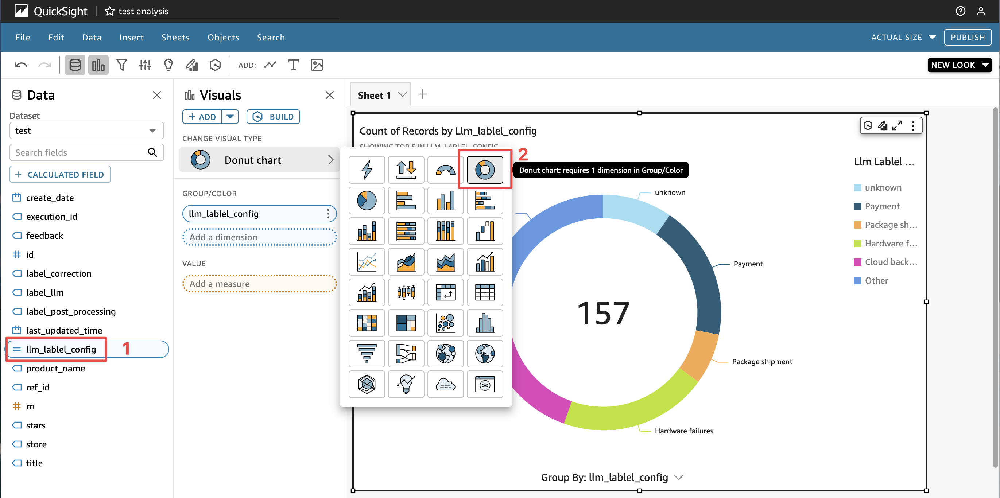


### TroubleShooting

1. Deployment in other region

AWS Lambda layers ARN can vary by region, and for the purpose of this proof of concept (POC), we are utilizing a layer that includes the pandas library.

For example for us-west-2, you need to use 
```python
arn:aws:lambda:us-west-2:336392948345:layer:AWSSDKPandas-Python312:6
```

please open the file `.projenrc.py` and modify the parameter  `sdk_pandas_layer` 

Please check your region here. https://aws-sdk-pandas.readthedocs.io/en/stable/layers.html


